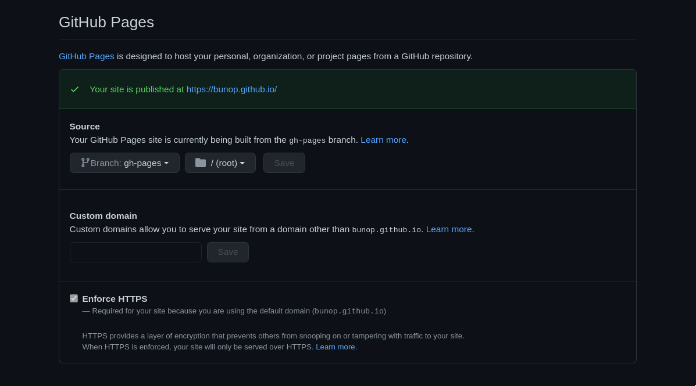
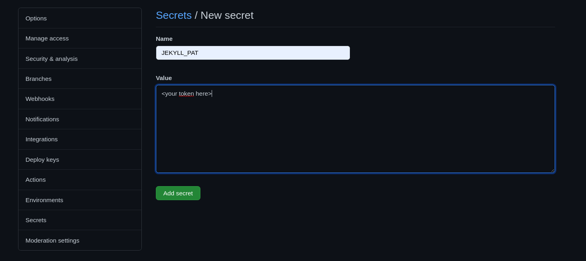

bunop.github.io - personal site
===============================

[](https://opensource.org/licenses/MIT)

[](https://bunop.github.io/)

This is the repository of my personal site at GitHub. It was developed
in [Jekyll](https://jekyllrb.com/) by adapting the
[Start Bootstap resume](https://startbootstrap.com/theme/resume)
template on the top of another my project template,
[jekyll-bootstrap](https://github.com/bunop/jekyll-bootstrap),
which attempted to install node dependencies inside a Jekyll project.

Running and edit the site locally
---------------------------------

1. Use this project as a template for a new repository (by forking this project
   in your personal site repository, ie: *`<your github user>.github.io`*)
2. Clone such repository locally
3. Install dependencies, both for node and jekyll, and copy *.js* files in the
   `assets/vendor` folder:
   ```
   npm install
   npm run copy:js
   bundle install
   ```
4. Edit `_config.yml` files and and `_data/*.yml` files according your needs. If
   you plan to modify or to add/remove sections from the site please remember to
   modify the `_data/navigation.yml` file (which is required by *navbar* in
   `_includes/navigation.html`) and the main `index.html` file
5. Check the `assets` folder and replace the profile photo in the `img` subfolder
6. Serve the site locally with `jekyll serve --livereload` and browse it at http://127.0.0.1:4000/

### Adding a new dependency with npm

You can add a new dependency with `npm install`: if you install new `sass` modules,
you will need to import them correctly in `_sass/main.scss` and jekyll will
import your definitions during build. *JS* code and other custom files not compiled
by Jekyll need to be copied in the `assets` folder by
modifying `package.json` file for the `scripts` key: despite you could access a
static file from the `node_modules` folder using `jekyll serve --livereload`, you are required
to copy such files in the `assets` folder in order to serve such files with a static
build. This could be achieved by calling a custom `npm run` *script* command,
like you did when installing this project.

Publishing site
---------------

Despite this project is intended for a [GitHub personal page](https://docs.github.com/en/free-pro-team@latest/github/working-with-github-pages/about-github-pages#types-of-github-pages-sites),
which is automatically configured by GitHub to be served from [the root of the default
branch](https://docs.github.com/en/free-pro-team@latest/github/working-with-github-pages/about-github-pages#publishing-sources-for-github-pages-sites), you need to
configure *GitHub Pages* in order to **serve a different branch of such repository**,
and you need also to build site manually or using *CI* systems: GitHub can build
automatically and serve pages built in [Jekyll using safe mode](https://docs.github.com/en/free-pro-team@latest/github/working-with-github-pages/about-github-pages-and-jekyll#configuring-jekyll-in-your-github-pages-site)
and this will not build the *bootstrap sass* dependencies installed in the
`node_modules` folder ([see Adding Sass load paths](https://simpleit.rocks/ruby/jekyll/tutorials/how-to-add-bootstrap-4-to-jekyll-the-right-way/#adding-sass-load-paths)).

This project is configured to install dependencies and build site using
[GitHub Actions](https://github.com/features/actions) (see configuration file in
`.github/workflows/github-pages.yml`). This will enable the `github-pages`
environment of your project, but you need to configure the also *GitHub Pages*
options in the *settings* tab of your repository in order to serve for the
**root** folder of the `gh-pages` branch:


*Configure GitHub pages to serve for a different root in a different branch*

You will need also to define a token in order to publish the built site into your
`gh-pages` branch, with the `public_repos` permission. This token need to be
placed in the `JEKYLL_PAT` variable of your repository secrets settings:


*Configure repository secrets to build `gh-pages` using GitHub workflow*

By configuring these, everytime you publish a new commint in the master branch
of such repository, the build and publishing process will be done automatically
with the defined GitHub worwflow. See
[GitHub Actions tutorial](https://jekyllrb.com/docs/continuous-integration/github-actions/#providing-permissions)
for more informations about Jekyll and GitHub workflows.

License
-------

This project and its dependencies are released under the
[MIT](https://github.com/bunop/jekyll-bootstrap/blob/master/LICENSE) license. You
could modify this code under this license according your needs, please remember
to remove my personal data and add your informations to make a great CV.

Credits
-------

This project was made starting from a [Jekyll](https://jekyllrb.com/) template and
by adding [bootstrap](https://getbootstrap.com/) and
[Start Bootstap resume](https://startbootstrap.com/theme/resume) template. This
guides inspired me to integrate bootstrap in a jekyll project:

* [Using a Bootstrap theme with Jekyll](https://experimentingwithcode.com/using-a-bootstrap-theme-with-jekyll/)
* [5 Steps To Add Bootstrap 4 To Jekyll The Right Way](https://simpleit.rocks/ruby/jekyll/tutorials/how-to-add-bootstrap-4-to-jekyll-the-right-way/)
* [An Introduction to Using Jekyll With Bootstrap 4](https://medium.com/better-programming/an-introduction-to-using-jekyll-with-bootstrap-4-6f2433afeda9)

The *Medium* section at the bottom of publication section was made by importing
code generated with https://medium-widget.pixelpoint.io/. Please see
[Embed Medium as a Blog on Your Site…](https://medium.com/datadriveninvestor/embed-medium-as-a-blog-on-your-site-54a1b49cbe16)
to have an idea on how to include your last *Medium* articles on your sites.
